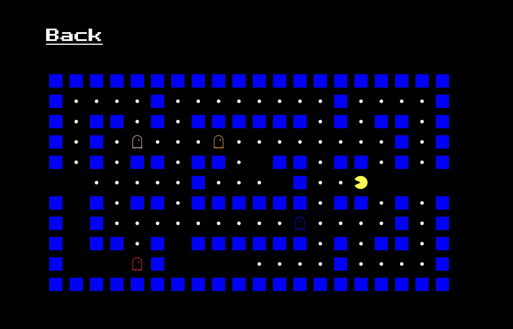

# Pac-Man

Pac-Man via image recognition

DEMO: <https://pacman.uoh-dakken.com>

## Overview



Through the webcam, your movements make Pacman move up, down, left and right. Run from the four colorful ghosts.

## Features

This project is a reconstruction of the [TensorFlow.js DEMO](https://storage.googleapis.com/tfjs-examples/webcam-transfer-learning/dist/index.html).

Our Pacman project written in [React](https://react.dev/) with [TypeScript](https://www.typescriptlang.org/). In particular, the image was classified into four classes using MobileNet's transfer learning in [Tensorflow.js](https://www.tensorflow.org/), and each class was adapted to move up, down, left and right.

## Dependencies

- VITE v4.4.4
- React
- Tensorflow.js
  - Tensorflow.js / mobilenet
- vanilla-extract

## Setup

- Clone the repository

```zsh
git clone git@github.com:dike-okayama/Pac-Man.git && cd Pac-Man
```

- Install dependencies

```zsh
npm install
```

## Usage

```zsh
npm run dev
```

or

```zsh
npm run build
```
